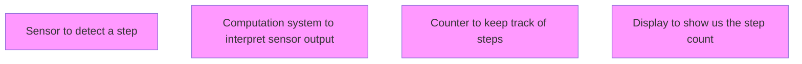
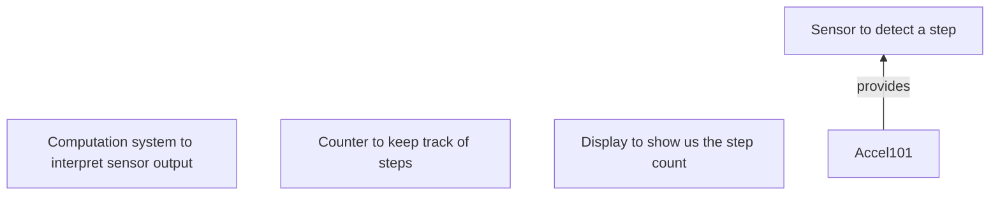
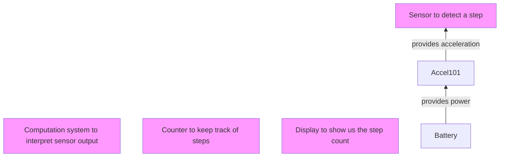
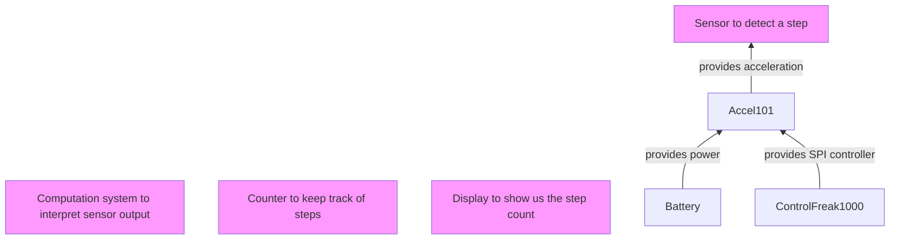
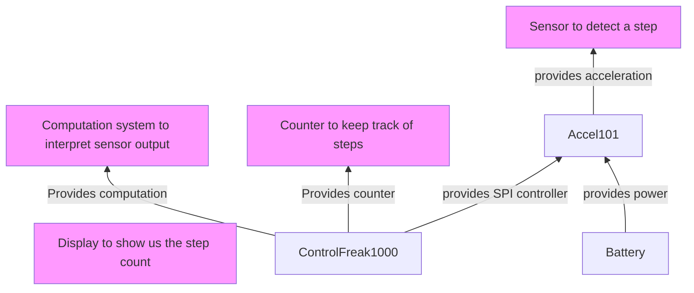
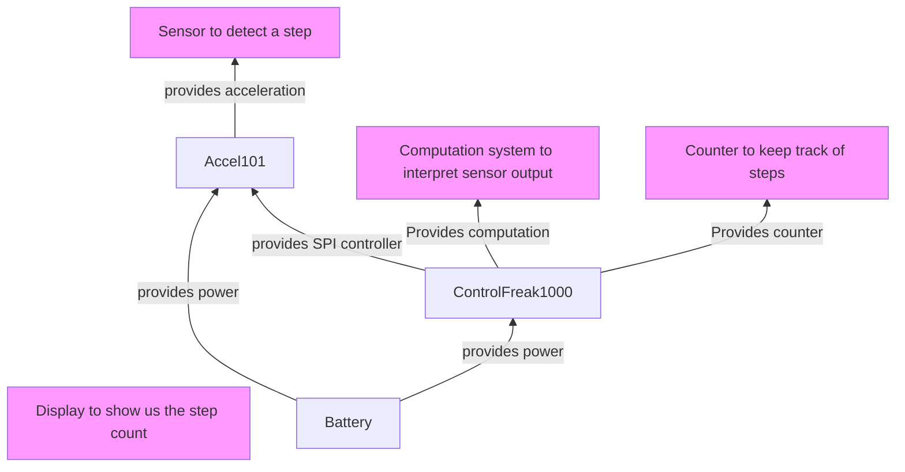
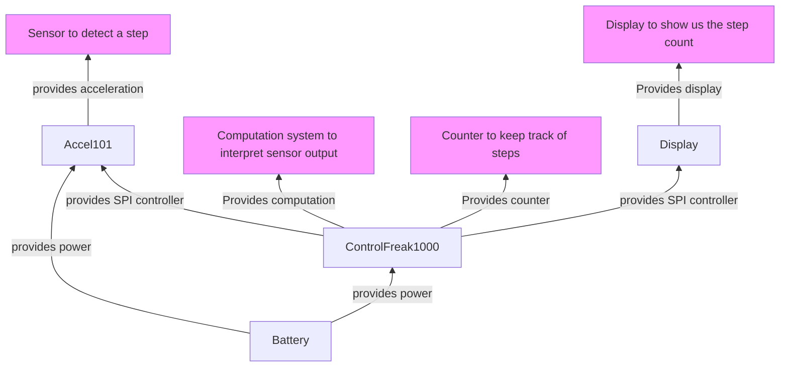

# Constructing a BOM
Now that we have defined our operational and manufacturing constraints. We can
start selecting components. At a high level this process would follow the
following approach.

- Pre-filtering based on manufacturing and operating constraints.
- For each behavior find a set of components/predefined sub-circuits that meet
  your needs. Narrow to single instantiate based on some heuristic.
- Each of the narrowed components/sub-circuits have their own constraints. These
  constraints should be handled recursively.
- An end state for BOM generation is met when each recursive component has it's
  requirements met.
- Optionally create a set cost reduction passes. For example while the first
  set of 'seed' components might have been chosen to be the cheapest, the sum of
  their supporting parts (i.e. recursively chosen) parts maybe more expensive.

This type of process predicates on having highly detailed;
- Footprints,
- Component descriptions (aka schematic libraries),
- Predefined functional sub-circuits.

> Note: While automation is great, sometimes for very specific reasons you want
> to choose a very specific part. It is the intention that it be possible to
> manually override each stage/pass in this process.

## Pre-filtering
Pre-filter parts database based on manufacturing and operating constraints. e.g.
The following database of resistors with the following pre-filter;

- Min temp: -20
- Min copper spacing: 0.65mm

| Value | Min temp | Package |
| ----- | -------- | ------- |
| 10k   | -5       | 0402    |
| 10k   | -10      | 0805    |
| 10k   | -40      | 0805    |
| 11k   | -40      | 0805    |

Would be reduced to;

| Value | Min temp | Package |
| ----- | -------- | ------- |
| 10k   | -40      | 0805    |
| 11k   | -40      | 0805    |

## Behavior matching
For each behavior search through your database of parts/predefined sub-circuits
and find a set of 'candidate' components that meet your requirements. This may
involve guiding this process of behavior down to function. e.g.

Using a some guiding heuristic (e.g. minimize component cost), choose a single
component/sub-circuit that meets the behavior. In some cases this can be
specialized down to a physical interface e.g.

A resistor with the follow constraints;
- Value: 10k
- Min temperature: -20
- Package: 0402

It is not necessary to specialize down to a particular part number at this point
as there are multiple parts that can meet the 0402 physical interface. This
can only be done on parts that have the same physical footprint/interface.

These first set of matching components are considered 'Seeds' for the rest of
the schematic, on which the schematic will naturally grow.

## Recursive behavior matching
As previously mentioned the 'seed' components have their own set of constraints
and requirements. e.g. An accelerometer sensor chosen in the previous step may
need 1.8-3.3V to operate, therefore the next stage of the recursive matching
might involve a buck converter and/or a battery.

## BOM optimization (Optional)
There are many opportunities for BOM cost reduction. While each recursive stage
might be optimized for cost. This involves a greedy and non-optimal search
pattern. There are also multiple areas where constraints can be reduced to allow
for a greater range of freedom in BOM reduction. e.g. Consider 3 parts A, B and
C currently candidates for the BOM.

*Part A has 2 pins*
- GND
- VDD
  - Requires 1.8-3.3V @ up to 50mA
  - Requires 80-200nF of capacitance for decoupling

*Part B has 2 pins*
- GND
- VDD
  - Requires 3.0-3.3V @ up to 800mA
  - Requires 90-150nF of capacitance for decoupling

*Part C has 2 pins*
- GND
- VDD
  - Requires 1.8-2.5V @ up to 5mA
  - Requires 90-150nF of capacitance for decoupling

It's fairly reasonable to assume that;
- A & C can share a power rail.
- A & B can share a power rail.
- B & C cannot share a power rail.

So at least two power rails will be required. However all three have a range of
capacitances that overlap such that an acceptable capacitor can be chosen for
all three reducing the unique component count. e.g. a 100nF capacitor with a 10%
tolerance will work for all three.

## Example
> Note: This example has some known issue;
> - Doesn't address logic levels in database search.
> - Doesn't address multi-purpose pin-remapping and conflicts.
> - Doesn't address the relationship between cpu->spi_peripheral.
> - Doesn't address the relationship between firmware size and flash storage.
> - SPI bus is shared between accelerometer and display. But the count for GPIO
>   chip selects isn't checked.
> - Doesn't include scenarios showing when multiple components match a given
>   requirement.
>
> There is a bit of a balance between writing a concise example and missing
> critical details. This is also a WIP and I haven't worked out all the details
> yet. If you think that I've missed something important please feel free to
> [open an issue](https://github.com/silvergasp/dialectic/issues/new/choose).
> If you think that you could improve this example feel free to contact me
> under the
> [discussions tab](https://github.com/silvergasp/dialectic/discussions).

Let's go back to our step counter, and see how this recursive component
selection might work on a simplified database of parts.

So let's say we start with a 'sensor to detect a step'. First we would need to
map this requirement to a physical phenomenon that can be measured. So when we
take a step with accelerate slightly forward and then accelerate slightly
backwards as our foot impacts the ground again. Not only that but we will likely
do a little bob vertically as well. So a sensor that can measure acceleration
with some post processing can count steps! Now it's likely that we will want to
constrain this further. For example we don't want a sensor that can only sample
once a second as we wouldn't be able to determine how many steps you take unless
you take less than 0.5 steps/s. So the world record for 'skips'/seconds is 9.6
skips/s. This is roughly the same motion as a step so let's use that as our
baseline. At that rate we would need at minimum 19.2Hz to prevent aliasing. But
it's likely that we would want significantly more. So let's go with 4x9.6=38.4Hz
as a minimum sampling rate.

> NOTE: there might be other was of doing this at a
later time e.g. using a ranging sensor that measures distance to the ground. So
it's still useful to keep the original abstract concept of a step counter.

So this is where we can start searching for a part in our database. To simplify
this example I've only put one sensor that will work. So find the 'Accelerometer'
sensor. So we find the part 'Accel101' that matches our sampling requirements.

Now we find that 'Accel101' has requirements on it's own. Specifically it needs
power and an SPI controller. So we search for a power provider that will work
for our accelerometer and we find a battery.

We then search for a device that can act as a SPI controller and find the
'ControlFreak1000' micro-controller.

The control freak micro-controller also by coincidence happens to provide
functionality for two more of our behavioral definitions via it's cpu;
- Computation system to interpret sensor output,
- Counter to keep track of steps.

The micro-controller however has a it's own requirements. Again we have to solve
the power problem. However as we've already chosen the battery, and the voltage
should work we just have to check that the battery can provide enough power for
both the accelerometer and the micro-controller at the same time. 0.1 + 0.01 < 1
so we can keep the battery in our proposed BOM.

We have one final behavior that we need to meet 'Display to show us the step
count', So we search through our database and find our 'Display100' part. Again
the display requires some power, we check our current BOM to see if we have
anything that can provide that. We find the battery, we just need to check that
the battery can supply power to the micro-controller, accelerometer and display
all at once. It can so we at this point we have an automatically generated BOM,
that meets our needs.

### Database
*Part: ControlFreak1000*
- cpu: Cortex-M0
- Spi: Provides controller
  - Count: 1
- GPIO: Provides in or output
  - Count: 4
- Power: Requires 1.8-3.3V @ up to 100mA
  - Decoupling:
    - Count: 4
    - Value: 100-200nF

*Part: Cap1*
- value: 1uF,
- tolerance: 10%,

*Part: Cap3*
- value: 120nF,
- tolerance: 10%,

*Part: Accel101*
- Acceleration: Provides 1-10G 24bit 200Hz sampling rate
- Spi: Requires controller
- CS: Requires GPIO
- Power: Requires 1.8-3.3V @ up to 10mA
  - Decoupling:
    - Count: 1
    - Value: 50-150nF

*Part: Battery*
- Provides 1.8-2.2V @ up to 1A

*Part: Display100*
- Display: Provides display
- Power: Requires 1.8-5.0V @ up to 100mA
  - Decoupling:
    - Count: 1
    - Value: 0.5-10uF
- Spi: Requires controller