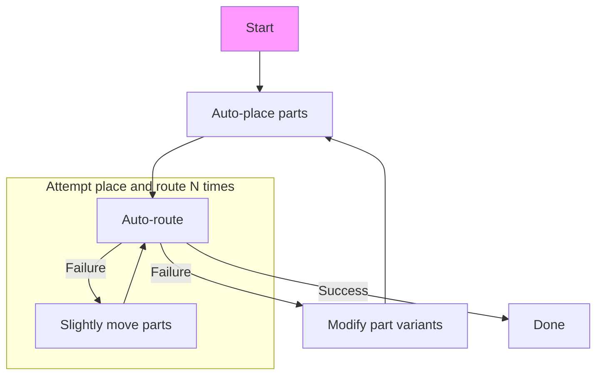
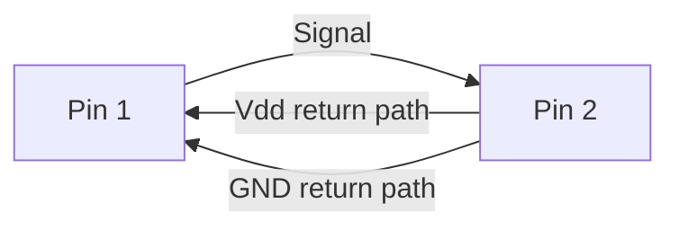

# Automatic place and route
> If you think that you could improve or feel like I've missed something
> important this page feel free to contact me under the
> [discussions tab](https://github.com/silvergasp/dialectic/discussions). Though
> keep in mind that this description is far from complete.

It's worth pointing out that the PCB layout community is understandably jaded
when it comes to auto-routing/placement. This comes from a long history of
sub-par auto-routers. I personally have used commercial auto-routers and had
them absolutely butcher my layout, ripping up more traces than it routed. So I
am approaching this problem with equal parts optimism and deep shades of jade.

Auto-routing is hard! A quick read over the
[Wikipedia page](https://en.wikipedia.org/wiki/Routing_(electronic_design_automation))
describing auto-routing and you'll see phrases like;

> "Almost every problem associated with routing is known to be intractable."

However the fact that these problems are 'intractable' is no excuse for poor
performance from an auto-router. After all we are able to route circuits
manually, usually with 'better' results.

So if we can manually route a circuit there is no reason why we can't develope
an algorithm to do the same thing automatically. After all we didn't evolve
to layout circuits so we don't have some fundamental evolutionary advantage that
we developed over 10,000s of years that a CPU does not.

So why don't auto-routers perform up to our expectations? I don't have all the
answers, but I have a set of hunches (which are open challenge).
1. Auto-routers don't have the same level of control as what we do. e.g. usually
   they can't pin-swap, they can't move parts around (e.g. to make more space
   for vias or length matching). They can't completely change package if a
   different footprint would work better.
2. We are biased to prefer manually routed circuits. In some cases auto-routers
   *may* be performing as good as our hand routed designs but we just don't
   recognize that because we are trained to like our circuits routed in a
   particular way.
3. Typically engineers will route a PCB using 'rules of thumb', which are
   **usually** simplifications of more complex physics. Often search algorithms
   (i.e. auto-routers) will quickly find edge cases and loop holes in simplified
   rules. Therefore we should give auto-routers more information as to the
   underlying physics associated with electronics.
4. We don't give auto-routers enough information about what we want our routing
   to look like. Without a suitable set of constraints we can't expect an
   auto-router to route a decent circuit. In other words garbage in garbage out.

## Proposed solution for dialectic auto-routing
The current proposal for auto-routing is to use a multi-stage iterative approach.
giving the auto-router full controllability over the design process. So simplified
pipeline would look something like the following.

### Routing algorithm
Routing algorithms started off fairly simple. With the first auto-router using
Lee's maze solving algorithm. Which is essentially a grid based breadth first
search with backtracking. Today most high end auto-routers use an algorithm
based on topological auto-routing which tends to work better for high-density
circuits.

#### Potential improvements on topological-routing
There are a couple of improvements that can be made to typical auto-routers;
1. Return path routing

##### Return path routing
Currently (at least in the auto-routers I've used) there is very little effort
put into routing/managing the signal return path. What I'd like to propose is
that each signal be treated as a set of two links (see
[topological link/knot theory](https://en.wikipedia.org/wiki/Link_(knot_theory))). At least
one of the two links with either a ground **or** power return path must be
routed into the board. By simultaneously routing both the signal and return path
you can minimize EMI and reduce signal integrity. While a power and/or ground
planes may still be used it will still likely be useful to keep track of your
routed return paths through those planes as intersections on the return path
routing may result in increased current density.

This approach has the most potential when routing 1-2 layer boards. For example
a ground trace can be routed parallel to signal traces to minimize EMI and
maximize signal integrity.

There is also significant gains to be made in very high speed designs, where
signal integrity and EMI are much more difficult to manage.

## Other constraints
In many cases there will be other constraints that need to be met for the circuit
to work as part of a larger electromechanical design e.g. connector locations
PCB shape etc. How these constraints are applied is yet to be determined.