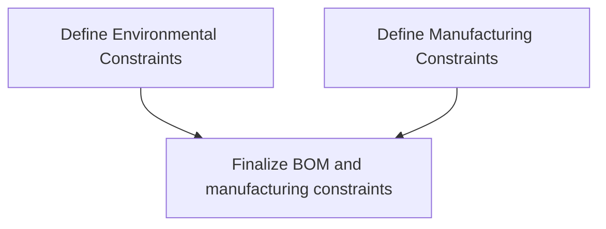
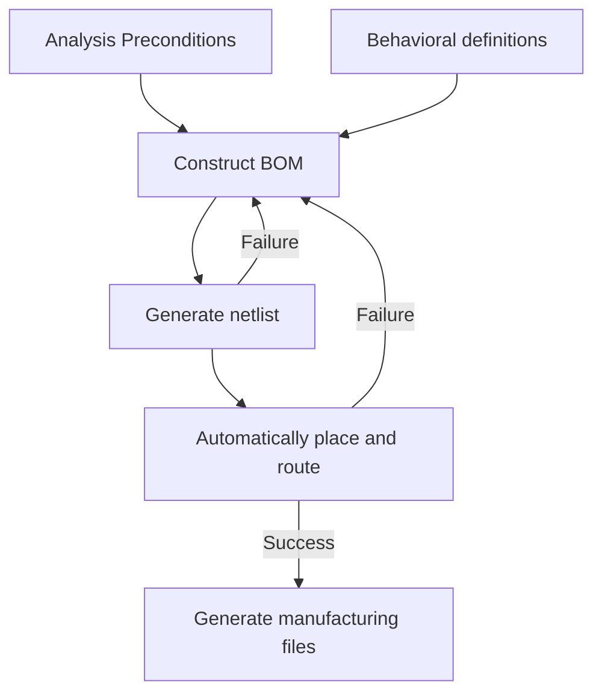

# Technical overview

The high level design for the dialectic HDL follows a similar
approach to what a team of engineers would follow. In this case
dialectic will implement this as a pipelined series of grouped passes.

> Note: This approach is largely inspired by the [CIRCT] project. With which
> this project
may integrate with as an additional dialect at some point.

Passes are grouped logically to ensure that each pass can operate on similar
data. For example consider the below group of passes.



First we constrain the environmental conditions that the end product needs to
operate in for example this may look something like;

```rust,ignore
let environment = dialectic::environment()
                    .temperature_range(-10.0,60.0)
                    .humidity_range(0.0, 80.0)
                    .pressure_range(500.mbar(), 1500.mbar());

// Manufacturing constraints from PCBway
let pcb_constraints = dialectic::pcb_manufacturing()
                    .stackup(
                        dialectic::Stackup::new(vec![
                            Material::Silkscreen(None),
                            Material::Soldermask(None),
                            Material::Copper(35.um()),
                            Material::Prepreg(0.11.mm(), 4.29.rel_permeability()),
                            // ...
                        ])
                    )
                    .width_range(5.0, 500.0)
                    .height_range(6.0, 1100.0)
                    .min_trace(0.1)
                    .min_spacing(0.1);
                    // more constraints... ;

let assembly_constraints = dialectic::assembly()
                    .components_on_top()
                    .components_on_bottom()
                    .max_reflow_temperature(270.0);
                    // more constrains... ;

let preconditions = dialectic::Preconditions::new(
    environment,
    pcb_constraints,
    assembly_constraints,
)
```

> Note: For the time being we will be using Rust as a generator language. But
> this may change depending on requirements.

By setting these preconditions we can;
- Build a set of filters from component selection based on;
  - Component size.
  - Spacing between pads on footprints.
  - Operational environment.
  - etc.
- Define a set of constraints for placement and routing.

## High level pipeline
While the first example show how a group of design passes **might** work it
doesn't give a full overview of what the entire system will look like.



To the untrained eye this system may seem like a simple one to put together.
However there are some very challenging and difficult problems to solve.


[CIRCT]: https://circt.llvm.org/